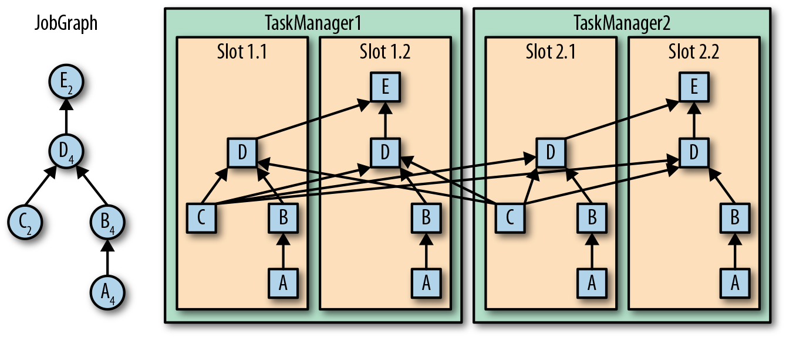

### 任务执行

一个TaskManager可以同时执行多个任务（tasks）。这些任务可以是同一个算子（operator）的子任务（数据并行），也可以是来自不同算子的（任务并行），甚至可以是另一个不同应用程序的（作业并行）。TaskManager提供了一定数量的处理插槽（processing slots），用于控制可以并行执行的任务数。一个slot可以执行应用的一个分片，也就是应用中每一个算子的一个并行任务。图3-2展示了TaskManagers，slots，tasks以及operators之间的关系：

最左边是一个“作业图”（JobGraph），包含了5个算子——它是应用程序的非并行表示。其中算子A和C是数据源（source），E是输出端（sink）。C和E并行度为2，而其他的算子并行度为4。因为最高的并行度是4，所以应用需要至少四个slot来执行任务。现在有两个TaskManager，每个又各有两个slot，所以我们的需求是满足的。作业管理器将JobGraph转化为“执行图”（ExecutionGraph），并将任务分配到四个可用的slot上。对于有4个并行任务的算子，它的task会分配到每个slot上。而对于并行度为2的operator C和E，它们的任务被分配到slot 1.1、2.1 以及 slot 1.2、2.2。将tasks调度到slots上，可以让多个tasks跑在同一个TaskManager内，也就可以是的tasks之间的数据交换更高效。然而将太多任务调度到同一个TaskManager上会导致TaskManager过载，继而影响效率。之后我们会在“控制任务调度”一节继续讨论如何控制任务的调度。

TaskManager在同一个JVM中以多线程的方式执行任务。线程较进程会更轻量级，但是线程之间并没有对任务进行严格隔离。所以，单个任务的异常行为有可能会导致整个TaskManager进程挂掉，当然也同时包括运行在此进程上的所有任务。通过为每个TaskManager配置单独的slot，就可以将应用在TaskManager上相互隔离开来。TaskManager内部有多线程并行的机制，而且在一台主机上可以部署多个TaskManager，所以Flink在资源配置上非常灵活，在部署应用时可以充分权衡性能和资源的隔离。我们将会在第九章对Flink集群的配置和搭建继续做详细讨论。

