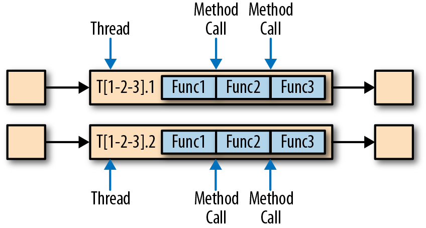

### 任务链

Flink采用了一种称为任务链的优化技术，可以在特定条件下减少本地通信的开销。为了满足任务链的要求，必须将两个或多个算子设为相同的并行度，并通过本地转发（local forward）的方式进行连接。图3-5所示的算子管道满足这些要求。它由三个算子组成，这些算子的任务并行度都被设为2，并且通过本地转发方式相连接。

图3-6展示了管道以任务链方式运行的过程。算子的函数被融合成了一个单一的任务，由一个线程执行。由函数生成的数据通过一个简单的方法调用移交给下一个函数；这样在函数之间直接传递数据，基本上没有序列化和通信成本。

任务链可以显著降低本地任务之间的通信成本，但也有一些场景，在没有链接的情况下运行管道操作是有意义的。例如，如果任务链中某个函数执行的开销巨大，那就可以将一条长的任务链管道断开，或者将一条链断开为两个任务，从而可以将这个开销大的函数调度到不同的槽（slots）中。图3-7显示了在没有任务链的情况下相同管道操作的执行情况。所有函数都由独立的单个任务来评估，每个任务都在专有的线程中运行。

任务链在Flink中默认会启用。在“控制任务链”一节中，我们展示了如何禁用应用程序的任务链，以及如何控制各个算子的链接行为。

