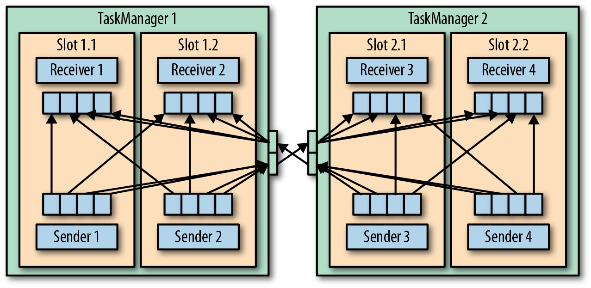

## Flink中的数据传输

运行中的应用任务，会持续不断地交换数据。TaskManager负责将数据从“发送任务”（sending tasks）传递到“接收任务”（receiving tasks）。TaskManager的网络组件会在缓冲区中收集数据，然后再将其发送，也就是说，数据不是逐条发送的，而是在缓冲区中“攒”成了一批。这种技术是有效利用网络资源和实现高吞吐量的基础，机制类似于网络或磁盘I/O协议中使用的缓冲技术。

>通过缓冲区来传递数据，意味着Flink的处理模型是基于微批的。

每个TaskManager都有一个网络缓冲池（默认大小为32KB），用于发送和接收数据。如果发送任务和接收任务运行在不同的TaskManager进程中，那么它们会通过操作系统的网络栈来进行通信。流应用程序需要以管道方式传递数据，所以每对TaskManager之间都需要维护一个永久TCP连接，用来交换数据。在无序连接模式下，每个发送任务都需要能向任何接收任务传递数据。所以我们发现，TaskManager需要为每一个接收任务设置一个专用的网络缓冲区，因为其中的每一个任务都需要接收数据。图3-4展示了这种架构。

如图3-4所示，四个发送任务中的每一个都需要至少四个网络缓冲区，用来向每个接收任务发送数据，而每个接收任务也需要至少四个缓冲区来接收数据。需要发送到另一个TaskManager的缓冲数据，会复用同一网络连接。为了实现平滑的管道数据传输，TaskManager必须能够提供足够的缓冲，来同时为所有传出和传入连接提供服务。对于无序或广播连接，每个发送任务都需要为每个接收任务提供一个缓冲；所以，所需缓冲区的数量是相关算子任务数量的平方。Flink网络缓冲区的默认配置足以满足中小型应用；对于更大的应用场景，就需要按照“主内存和网络缓冲区”一节中的叙述调整配置了。

当发送任务和接收任务在同一个TaskManager进程中运行时，发送任务会将传出的数据序列化，放入字节缓冲区，并在缓冲区填满后将其放入队列。接收任务从队列中提取缓冲数据并对其进行反序列化。因此，在同一个TaskManager上运行的任务，它们之间的数据传输不会导致网络通信。

Flink采用不同的技术来降低任务之间的通信成本。在下面的部分中，我们会简要讨论基于信任度（Credit）的流控制和任务链。

