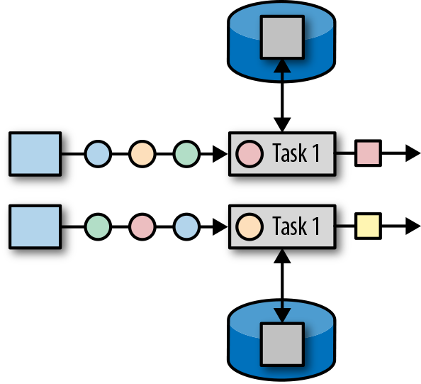

### 算子状态

算子状态的作用范围限定为算子任务。这意味着由同一并行任务所处理的所有数据都可以访问到相同的状态，状态对于同一任务而言是共享的。算子状态不能由相同或不同算子的另一个任务访问。图3-11显示了任务如何访问算子状态。

Flink为算子状态提供三种基本数据结构：

#### 列表状态

将状态表示为一组数据的列表。

#### 联合列表状态

也将状态表示为数据的列表。它与常规列表状态的区别在于，在发生故障时，或者从保存点（savepoint）启动应用程序时如何恢复。我们将在后面继续讨论。

#### 广播状态

如果一个算子有多项任务，而它的每项任务状态又都相同，那么这种特殊情况最适合应用广播状态。在保存检查点和重新调整算子并行度时，会用到这个特性。这两部分内容将在本章后面讨论。

