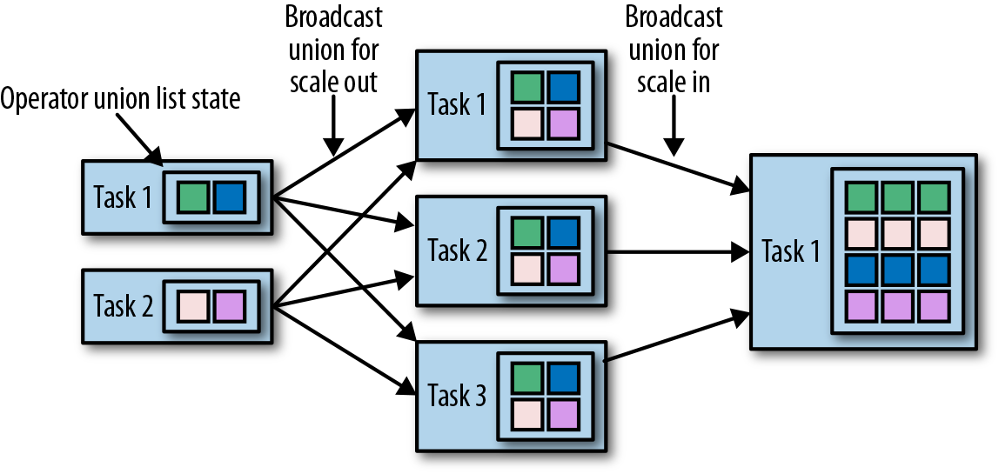

### 调整有状态算子的并行度

流应用程序的一个常见要求是，为了增大或较小输入数据的速率，需要灵活地调整算子的并行度。对于无状态算子而言，并行度的调整没有任何问题，但更改有状态算子的并行度显然就没那么简单了，因为它们的状态需要重新分区并分配给更多或更少的并行任务。 Flink支持四种模式来调整不同类型的状态。

具有键控状态的算子通过将键重新分区为更少或更多任务来缩放并行度。不过，并行度调整时任务之间会有一些必要的状态转移。为了提高效率，Flink并不会对单独的key做重新分配，而是用所谓的“键组”（key group）把键管理起来。键组是key的分区形式，同时也是Flink为任务分配key的方式。图3-13显示了如何在键组中重新分配键控状态。

具有算子列表状态的算子，会通过重新分配列表中的数据项目来进行并行度缩放。从概念上讲，所有并行算子任务的列表项目会被收集起来，并将其均匀地重新分配给更少或更多的任务。如果列表条目少于算子的新并行度，则某些任务将以空状态开始。图3-14显示了算子列表状态的重新分配。

具有算子联合列表状态的算子，会通过向每个任务广播状态的完整列表，来进行并行度的缩放。然后，任务可以选择要使用的状态项和要丢弃的状态项。图3-15显示了如何重新分配算子联合列表状态。

具有算子广播状态的算子，通过将状态复制到新任务，来增大任务的并行度。这是没问题的，因为广播状态保证了所有任务都具有相同的状态。而对于缩小并行度的情况，我们可以直接取消剩余任务，因为状态是相同的，已经被复制并且不会丢失。图3-16显示了算子广播状态的重新分配。

