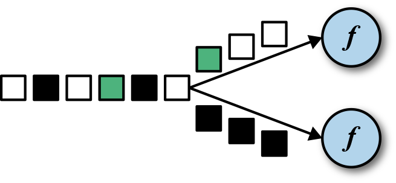

### 键控流转换算子

很多流处理程序的一个基本要求就是要能对数据进行分组，分组后的数据共享某一个相同的属性。DataStream API提供了一个叫做`KeyedStream`的抽象，此抽象会从逻辑上对DataStream进行分区，分区后的数据拥有同样的`Key`值，分区后的流互不相关。

针对KeyedStream的状态转换操作可以读取数据或者写入数据到当前事件Key所对应的状态中。这表明拥有同样Key的所有事件都可以访问同样的状态，也就是说所以这些事件可以一起处理。

>要小心使用状态转换操作和基于Key的聚合操作。如果Key的值越来越多，例如：Key是订单ID，我们必须及时清空Key所对应的状态，以免引起内存方面的问题。稍后我们会详细讲解。

KeyedStream可以使用map，flatMap和filter算子来处理。接下来我们会使用keyBy算子来将DataStream转换成KeyedStream，并讲解基于key的转换操作：滚动聚合和reduce算子。

*KEYBY*

keyBy通过指定key来将DataStream转换成KeyedStream。基于不同的key，流中的事件将被分配到不同的分区中去。所有具有相同key的事件将会在接下来的操作符的同一个子任务槽中进行处理。拥有不同key的事件可以在同一个任务中处理。但是算子只能访问当前事件的key所对应的状态。

如图5-4所示，把输入事件的颜色作为key，黑色的事件输出到了一个分区，其他颜色输出到了另一个分区。



`keyBy()`方法接收一个参数，这个参数指定了key或者keys，有很多不同的方法来指定key。我们将在后面讲解。下面的代码声明了`id`这个字段为SensorReading流的key。

**scala version**

```scala
val keyed: KeyedStream[SensorReading, String] = readings.keyBy(r => r.id)
```

匿名函数`r => r.id`抽取了传感器读数SensorReading的id值。

**java version**

```java
KeyedStream<SensorReading, String> keyed = readings.keyBy(r -> r.id);
```

匿名函数`r -> r.id`抽取了传感器读数SensorReading的id值。

*滚动聚合*

滚动聚合算子由`KeyedStream`调用，并生成一个聚合以后的DataStream，例如：sum，minimum，maximum。一个滚动聚合算子会为每一个观察到的key保存一个聚合的值。针对每一个输入事件，算子将会更新保存的聚合结果，并发送一个带有更新后的值的事件到下游算子。滚动聚合不需要用户自定义函数，但需要接受一个参数，这个参数指定了在哪一个字段上面做聚合操作。DataStream API提供了以下滚动聚合方法。

>滚动聚合算子只能用在滚动窗口，不能用在滑动窗口。

* sum()：在输入流上对指定的字段做滚动相加操作。
* min()：在输入流上对指定的字段求最小值。
* max()：在输入流上对指定的字段求最大值。
* minBy()：在输入流上针对指定字段求最小值，并返回包含当前观察到的最小值的事件。
* maxBy()：在输入流上针对指定字段求最大值，并返回包含当前观察到的最大值的事件。

滚动聚合算子无法组合起来使用，每次计算只能使用一个单独的滚动聚合算子。

下面的例子根据第一个字段来对类型为`Tuple3<Int, Int, Int>`的流做分流操作，然后针对第二个字段做滚动求和操作。

**scala version**

```scala
val inputStream = env.fromElements((1, 2, 2), (2, 3, 1), (2, 2, 4), (1, 5, 3))

val resultStream = inputStream.keyBy(0).sum(1)
```

**java version**

```java
DataStream<Tuple3<Integer, Integer, Integer>> inputStream = env.fromElements(new Tuple3(1, 2, 2), new Tuple3(2, 3, 1), new Tuple3(2, 2, 4), new Tuple3(1, 5, 3));

DataStream<Tuple3<Integer, Integer, Integer>> resultStream = inputStream
  .keyBy(0) // key on first field of the tuple
  .sum(1);   // sum the second field of the tuple in place
```

在这个例子里面，输入流根据第一个字段来分流，然后在第二个字段上做计算。对于key 1，输出结果是(1,2,2),(1,7,2)。对于key 2，输出结果是(2,3,1),(2,5,1)。第一个字段是key，第二个字段是求和的数值，第三个字段未定义。

>滚动聚合操作会对每一个key都保存一个状态。因为状态从来不会被清空，所以我们在使用滚动聚合算子时只能使用在含有有限个key的流上面。

*REDUCE*

reduce算子是滚动聚合的泛化实现。它将一个ReduceFunction应用到了一个KeyedStream上面去。reduce算子将会把每一个输入事件和当前已经reduce出来的值做聚合计算。reduce操作不会改变流的事件类型。输出流数据类型和输入流数据类型是一样的。

reduce函数可以通过实现接口ReduceFunction来创建一个类。ReduceFunction接口定义了`reduce()`方法，此方法接收两个输入事件，输入一个相同类型的事件。

```
// T: the element type
ReduceFunction[T]
    > reduce(T, T): T
```

下面的例子，流根据传感器ID分流，然后计算每个传感器的当前最大温度值。

**scala version**

```scala
val maxTempPerSensor = keyed.reduce((r1, r2) => r1.temperature.max(r2.temperature))
```

**java version**

```java
DataStream<SensorReading> maxTempPerSensor = keyed
        .reduce((r1, r2) -> {
            if (r1.temperature > r2.temperature) {
                return r1;
            } else {
                return r2;
            }
        });
```

>reduce作为滚动聚合的泛化实现，同样也要针对每一个key保存状态。因为状态从来不会清空，所以我们需要将reduce算子应用在一个有限key的流上。

