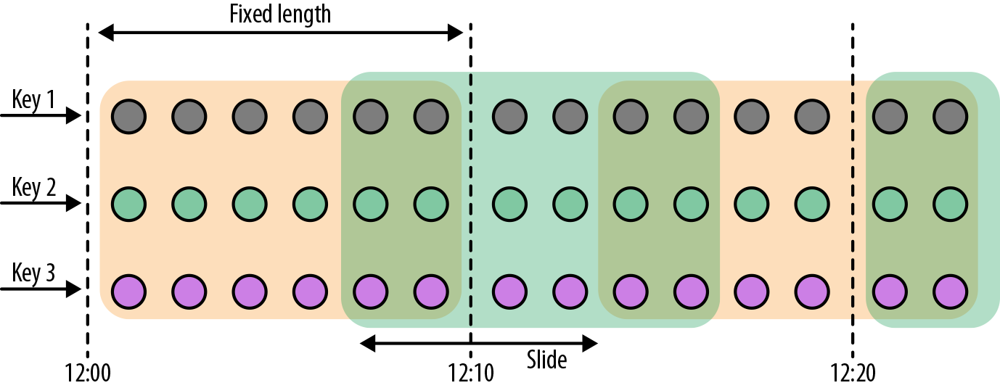

### 内置的窗口分配器

窗口分配器将会根据事件的事件时间或者处理时间来将事件分配到对应的窗口中去。窗口包含开始时间和结束时间这两个时间戳。

所有的窗口分配器都包含一个默认的触发器：

* 对于事件时间：当水位线超过窗口结束时间，触发窗口的求值操作。
* 对于处理时间：当机器时间超过窗口结束时间，触发窗口的求值操作。

>需要注意的是：当处于某个窗口的第一个事件到达的时候，这个窗口才会被创建。Flink不会对空窗口求值。

Flink创建的窗口类型是`TimeWindow`，包含开始时间和结束时间，区间是左闭右开的，也就是说包含开始时间戳，不包含结束时间戳。

*滚动窗口(tumbling windows)*


```java
DataStream<SensorReading> sensorData = ...

DataStream<T> avgTemp = sensorData
  .keyBy(r -> r.id)
  // group readings in 1s event-time windows
  .window(TumblingEventTimeWindows.of(Time.seconds(1)))
  .process(new TemperatureAverager);

DataStream<T> avgTemp = sensorData
  .keyBy(r -> r.id)
  // group readings in 1s processing-time windows
  .window(TumblingProcessingTimeWindows.of(Time.seconds(1)))
  .process(new TemperatureAverager);

// 其实就是之前的
// shortcut for window.(TumblingEventTimeWindows.of(size))
DataStream<T> avgTemp = sensorData
  .keyBy(r -> r.id)
  .timeWindow(Time.seconds(1))
  .process(new TemperatureAverager);
```

默认情况下，滚动窗口会和`1970-01-01-00:00:00.000`对齐，例如一个1小时的滚动窗口将会定义以下开始时间的窗口：00:00:00，01:00:00，02:00:00，等等。

*滑动窗口(sliding window)*

对于滑动窗口，我们需要指定窗口的大小和滑动的步长。当滑动步长小于窗口大小时，窗口将会出现重叠，而元素会被分配到不止一个窗口中去。当滑动步长大于窗口大小时，一些元素可能不会被分配到任何窗口中去，会被直接丢弃。

下面的代码定义了窗口大小为1小时，滑动步长为15分钟的窗口。每一个元素将被分配到4个窗口中去。



```java
DataStream<T> slidingAvgTemp = sensorData
  .keyBy(r -> r.id)
  .window(
    SlidingEventTimeWindows.of(Time.hours(1), Time.minutes(15))
  )
  .process(new TemperatureAverager);

DataStream<T> slidingAvgTemp = sensorData
  .keyBy(r -> r.id)
  .window(
    SlidingProcessingTimeWindows.of(Time.hours(1), Time.minutes(15))
  )
  .process(new TemperatureAverager);

DataStream<T> slidingAvgTemp = sensorData
  .keyBy(r -> r.id)
  .timeWindow(Time.hours(1), Time.minutes(15))
  .process(new TemperatureAverager);
```

*会话窗口(session windows)*

会话窗口不可能重叠，并且会话窗口的大小也不是固定的。不活跃的时间长度定义了会话窗口的界限。不活跃的时间是指这段时间没有元素到达。下图展示了元素如何被分配到会话窗口。


```java
DataStream<T> sessionWindows = sensorData
  .keyBy(r -> r.id)
  .window(EventTimeSessionWindows.withGap(Time.minutes(15)))
  .process(...);

DataStream<T> sessionWindows = sensorData
  .keyBy(r -> r.id)
  .window(ProcessingTimeSessionWindows.withGap(Time.minutes(15)))
  .process(...);
```

由于会话窗口的开始时间和结束时间取决于接收到的元素，所以窗口分配器无法立即将所有的元素分配到正确的窗口中去。相反，会话窗口分配器最开始时先将每一个元素分配到它自己独有的窗口中去，窗口开始时间是这个元素的时间戳，窗口大小是session gap的大小。接下来，会话窗口分配器会将出现重叠的窗口合并成一个窗口。

