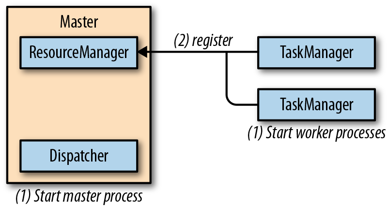

### 独立集群

独立集群包含至少一个master进程，以及至少一个TaskManager进程，TaskManager进程运行在一台或者多台机器上。所有的进程都是JVM进程。下图展示了独立集群的部署。



master进程在不同的线程中运行了一个Dispatcher和一个ResourceManager。一旦它们开始运行，所有TaskManager都将在Resourcemanager中进行注册。下图展示了一个任务如何提交到一个独立集群中去。


客户端向Dispatcher提交了一个任务，Dispatcher将会启动一个作业管理器线程，并提供执行所需的JobGraph。作业管理器向ResourceManager请求必要的task slots。一旦请求的slots分配好，作业管理器就会部署job。

在standalone这种部署方式中，master和worker进程在失败以后，并不会自动重启。如果有足够的slots可供使用，job是可以从一次worker失败中恢复的。只要我们运行多个worker就好了。但如果job想从master失败中恢复的话，则需要进行高可用(HA)的配置了。

*部署步骤*

下载压缩包

链接：http://mirror.bit.edu.cn/apache/flink/flink-1.11.0/flink-1.11.0-bin-scala_2.11.tgz

解压缩

```sh
$ tar xvfz flink-1.11.0-bin-scala_2.11.tgz
```

启动集群

```sh
$ cd flink-1.11.0
$ ./bin/start-cluster.sh
```

检查集群状态可以访问：http://localhost:8081

部署分布式集群

1. 所有运行TaskManager的机器的主机名（或者IP地址）都需要写入`./conf/slaves`文件中。
2. `start-cluster.sh`脚本需要所有机器的无密码的SSH登录配置，方便启动TaskManager进程。
3. Flink的文件夹在所有的机器上都需要有相同的绝对路径。
4. 运行master进程的机器的主机名或者IP地址需要写在`./conf/flink-conf.yaml`文件的`jobmanager.rpc.address`配置项。

一旦部署好，我们就可以调用`./bin/start-cluster.sh`命令启动集群了，脚本会在本地机器启动一个作业管理器，然后在每个slave机器上启动一个TaskManager。停止运行，请使用`./bin/stop-cluster.sh`。

