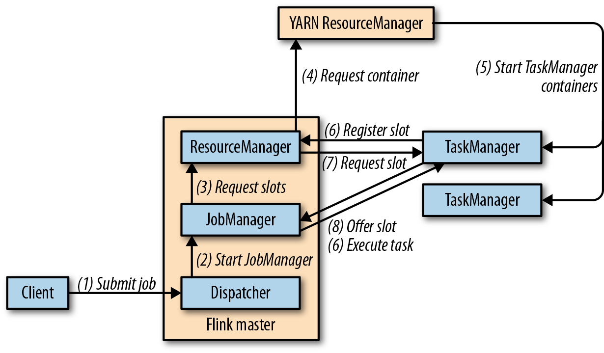

### Apache Hadoop Yarn

YARN是Apache Hadoop的资源管理组件。用来计算集群环境所需要的CPU和内存资源，然后提供给应用程序请求的资源。

Flink在YARN上运行，有两种模式：job模式和session模式。在job模式中，Flink集群用来运行一个单独的job。一旦job结束，Flink集群停止，并释放所有资源。下图展示了Flink的job如何提交到YARN集群。


当客户端提交任务时，客户端将建立和YARN ResourceManager的连接，然后启动一个新的YARN应用的master进程，进程中包含一个作业管理器线程和一个ResourceManager。作业管理器向ResourceManager请求所需要的slots，用来运行Flink的job。接下来，Flink的ResourceManager将向Yarn的ResourceManager请求容器，然后启动TaskManager进程。一旦启动，TaskManager会将slots注册在Flink的ResourceManager中，Flink的ResourceManager将把slots提供给作业管理器。最终，作业管理器把job的任务提交给TaskManager执行。

sesison模式将启动一个长期运行的Flink集群，这个集群可以运行多个job，需要手动停止集群。如果以session模式启动，Flink将会连接到YARN的ResourceManager，然后启动一个master进程，包括一个Dispatcher线程和一个Flink的ResourceManager的线程。下图展示了一个Flink YARN session的启动。


当一个作业被提交运行，分发器将启动一个作业管理器线程，这个线程将向Flink的资源管理器请求所需要的slots。如果没有足够的slots，Flink的资源管理器将向YARN的资源管理器请求额外的容器，来启动TaskManager进程，并在Flink的资源管理器中注册。一旦所需slots可用，Flink的资源管理器将把slots分配给作业管理器，然后开始执行job。下图展示了job如何在session模式下执行。



无论是作业模式还是会话模式，Flink的ResourceManager都会自动对故障的TaskManager进行重启。你可以通过`./conf/flink-conf.yaml`配置文件来控制Flink在YARN上的故障恢复行为。例如，可以配置有多少容器发生故障后终止应用。

无论使用job模式还是sesison模式，都需要能够访问Hadoop。

job模式可以用以下命令来提交任务：

```sh
$ ./bin/flink run -m yarn-cluster ./path/to/job.jar
```

参数`-m`用来定义提交作业的目标主机。如果加上关键字`"yarn-cluster"`，客户端会将作业提交到由Hadoop配置所指定的YARN集群上。Flink的CLI客户端还支持很多参数，例如用于控制TaskManager容器内存大小的参数等。有关它们的详细信息，请参阅文档。Flink集群的Web UI由YARN集群某个节点上的主进程负责提供。你可以通过YARN的Web UI对其进行访问，具体链接位置在"Tracking URL: ApplicationMaster"下的Application Overview页面上。

session模式则是

```sh
$ ./bin/yarn-session.sh # 启动一个yarn会话
$ ./bin/flink run ./path/to/job.jar # 向会话提交作业
```

>Flink的Web UI链接可以从YARN Web UI的Application Overview页面上找到。

